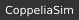

# Alessandro Carotenuto

**MSc Student in Artificial Intelligence & Robotics** · La Sapienza University of Rome

---

## About

MSc student in Artificial Intelligence and Robotics at La Sapienza University of Rome, with a BSc in Computer and Automation Engineering. I work across machine learning, computer vision and robotic systems, and I tend to go deep into whatever I build. Private tutor in Maths, Physics and CS since 2017.

---

## Projects

### Artificial Intelligence
<table width="100%">
<colgroup><col width="50%"><col width="25%"><col width="25%"></colgroup>
<thead><tr><th>Project</th><th>Topics</th><th>Tools</th></tr></thead>
<tbody>
<tr><td align="center"><a href="https://git.new/WGHRLex"><b>World Graph Hierarchical RL</b></a>  </td><td>   </td><td> </td></tr>
<tr><td align="center"><a href="https://git.new/synsatTT"><b>Ground-to-Aerial Image Synthesis</b></a>  </td><td>   </td><td> </td></tr>
</tbody>
</table>

### Robotics
<table width="100%">
<colgroup><col width="50%"><col width="25%"><col width="25%"></colgroup>
<thead><tr><th>Project</th><th>Topics</th><th>Tools</th></tr></thead>
<tbody>
<tr><td align="center"><a href="https://git.new/CBFcoord"><b>Distributed Multi-Robot Collision Avoidance</b></a>  </td><td>   </td><td> </td></tr>
<tr><td align="center"><a href="https://git.new/quadland"><b>Autonomous Quadrotor Vision-Based Landing</b></a>  </td><td>   </td><td>  </td></tr>
</tbody>
</table>

### Software Development
<table width="100%">
<colgroup><col width="50%"><col width="25%"><col width="25%"></colgroup>
<thead><tr><th>Project</th><th>Topics</th><th>Tools</th></tr></thead>
<tbody>
<tr><td align="center"><a href="https://github.com/SapienzaInteractiveGraphicsCourse/final-project-intentionallyblankname"><b>Mecha-Basketball 3D WebGame</b></a>  </td><td>   </td><td>  </td></tr>
<tr><td align="center"><a href="https://github.com/Alessandro-Carotenuto/Terminal-Practice-Game"><b>Terminal Practice CppGame</b></a>  </td><td>   </td><td> </td></tr>
</tbody>
</table>

### Work in Progress
<table width="100%">
<colgroup><col width="50%"><col width="25%"><col width="25%"></colgroup>
<thead><tr><th>Project</th><th>Topics</th><th>Tools</th></tr></thead>
<tbody>
<tr><td><b>Deep Learning and ML Framework from Scratch</b></td><td>  </td><td>  </td></tr>
<tr><td><a href="https://github.com/Alessandro-Carotenuto/Robotics-FASE-Toolbox"><b>Robotics FASE Toolbox</b></a></td><td>   </td><td> </td></tr>
</tbody>
</table>

---

## Tech Stack

<table width="100%">
<thead><tr><th width="20%">Category</th><th>Tools</th></tr></thead>
<tbody>
<tr><td><b>Languages</b></td><td>    </td></tr>
<tr><td><b>ML / AI</b></td><td>    </td></tr>
<tr><td><b>Robotics / Control</b></td><td>  </td></tr>
<tr><td><b>Tools</b></td><td>  </td></tr>
</tbody>
</table>

---

## Education

🎓 **MSc** Artificial Intelligence & Robotics — La Sapienza University of Rome *(in progress)*

🎓 **BSc** Computer & Automation Engineering — La Sapienza University of Rome

→ Full details and project write-ups on [my personal website](https://alessandro-carotenuto.github.io)
